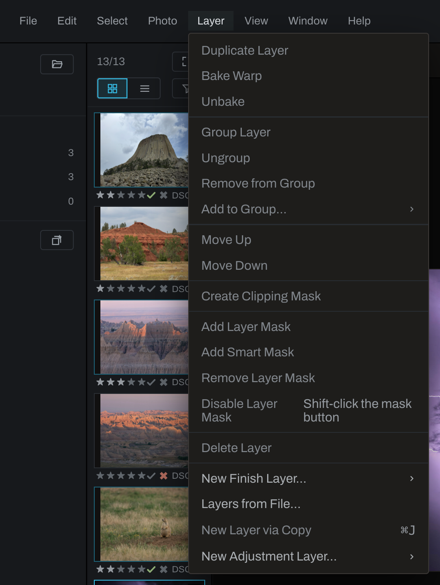
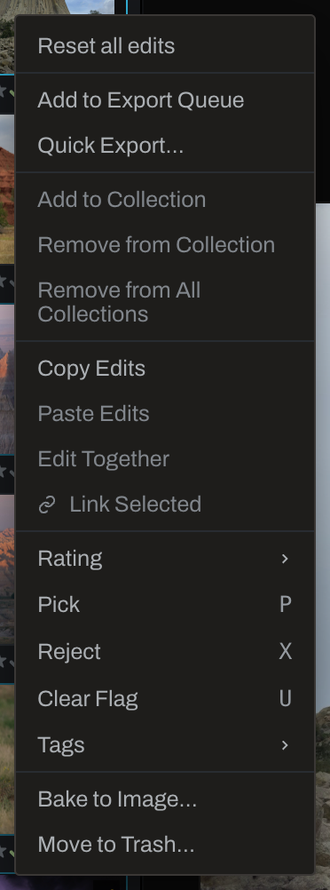

# Menus

The menu bar changes slightly with the workspace. Develop shows **Layer**; Graph and Canvas show **Node**. Commands that cannot run remain visible but disabled. Point to one to read what it does and what context enables it. Shortcut labels reflect your current bindings in Preferences.

## File

- **Open folder…** adds a folder of photographs to the catalog and opens it.
- **Recent Catalogs** folds out the last ten catalogs this computer has had open, most recent first, with the one in use ticked; choose one to switch to it. Right-click an entry for **Remove from this list**, or choose **Clear list** at the bottom to empty it; both forget a path and leave every database where it is. A catalog whose file is not there right now, on an unplugged drive for instance, is shown grayed and stays in the list. While a slow drive is still answering, its entry stays usable and says so when you point at it. The full history, past the ten the menu shows, is in Catalogs and recovery.
- **Catalogs and recovery…** creates, opens, copies, moves, or merges the catalog database that stores library records and organization. Its [recovery controls](recovery.md) follow catalog creation, opening, and import: Catalog backup preserves the database; Recovery bundle also preserves edit graphs, takes, and user presets. Verify recovery bundle checks the bundle and referenced originals offline.
- **Preferences…** (`Cmd+,`, `Ctrl+,` on Windows) opens the settings, in tabs: General, Interface, Editing & Brush, Import & Files, Export, Scripting, Assistant, Models, Storage, Backup and Hotkeys. It is on this File menu on a Mac too. A few of the tabs:
  - **Interface**: the **Adjustment sections** sub tab chooses which sections the Adjustments panel shows and which sit pinned at its top; see [Hiding sections](adjustments/README.md#hiding-sections).
  - **Editing & Brush**: the brush's grain steps, **Mask overlay color** (red, magenta, cyan or green, each with its dot) and **Mask overlay opacity**, how strongly every mask overlay and depth view tints where the mask is white (50 percent to start, grays in proportion). The brush panel's Overlay slider starts from it each session.
  - **Import & Files**: how a newly imported RAW starts, **RAW default profile** (Linear, Standard or Film) and, below it, **RAW default sharpening** (Off, Low, Standard or High, the [Source section's Sharpening](adjustments/source.md); Standard to start). Both apply only to photographs opened for the first time after the change and to a Reset all edits; a photograph that already has edits keeps its own choice. Rendered files (JPEG, TIFF and the like) and Bake to Image results are never capture sharpened.
  - **Export**: **Never overwrite an existing file** saves an export whose name is taken to the next free name (`-2`, `-3`); off, a save dialog's Replace? is honored. No export ever writes over a photograph in your library (see [Export](export.md)).
  - **Scripting**: **Media server share link**, **With token** to protect the link with an access token or **Just IP and port** for a shorter address on a trusted home network.
  - **Models**: see [Downloaded models](models.md); it also sets the Depth Map defaults, such as **Depth map detail** (518, 700 or 1036, see [Depth Map](adjustments/depth-map.md)).
  - **Storage**: the three caches Heeler keeps on disk (thumbnails, inside the catalog file; stack and panorama proxies; the depth and matte rasters the smart tools compute), each with its size, **Clear** and **Show on disk**. Clearing loses nothing you made: each cache rebuilds as you work. Baked selections and chosen inpaint fills are not caches, since nothing can make them again, so they live in a folder of their own that Clear never enters.
  - **Backup**: catalog backups and **Keep baked pictures in backups**; see [Recovery](recovery.md).
- **Exit** closes Heeler. Edits have already been saved as they were made. On a Mac, **Quit Heeler** (`Cmd+Q`) in the system menu bar at the top of the screen does the same; Heeler's own menus, described on this page, are in its window's title bar on every platform.

## Edit

- **Undo** steps backward one edit.
- **Redo** restores an edit that was undone.
- **Duplicate Nodes** (`Cmd+D` on a Mac, `Ctrl+D` on Windows and Linux) copies the selected nodes in the Graph or Canvas workspace, offset beside them with the wires among them, and the copies become the selection. It works in the popped-out graph window too. Groups and recipes copy whole. The photograph, Output, a layer's own cards and the Finish stack are not copied, and a notice names what was left behind. In Develop the same key is **Select > Deselect**.
- **Reset all edits** returns the active photograph to its imported state and folds the sections that start folded, so the panel reads as it does for a fresh photograph. With several thumbnails selected, every one of them is reset. One Undo takes the whole reset back: every photograph it reset gets its edits, its edited badge and its thumbnail again, including one reset from its thumbnail while another photograph was open. A photograph you edit again after the reset keeps the new edits. On a linked photograph the reset lands on the whole link: a member with no override goes back to its imported state too, one with an override keeps the overridden section or dial and takes the reset around it, and a pinned member sits it out.
- **Move to Trash…** moves selected files into a `.trash` folder beside them. Heeler never empties it.
- **Forget Missing Trashed Photos…** removes trashed photographs whose file is no longer in `.trash` from the catalog, with their edits. No file is touched; grayed when there are none.

## Select

### Interactive Selection

Choose **Rectangle**, **Ellipse**, **Pen**, **Freehand**, **Magnetic**, **Color brush**, **Color pick** or **Region Select**. This submenu is where the Select tool and its cursor come from: choosing a method arms the tool with that method, exactly as the Finish toolbar's select button does.

### Smart Selection

**Click**, **Subject**, and **Sky** ask a model instead of drawing geometry, and they create selections only, never layers. Click selects what you click on (`Option`-click, `Alt`-click on Windows, carves away); Subject and Sky each select theirs in one shot. Drawn regions combine on top of a smart selection like on any other, and Deselect drops the smart result along with everything else.

### Select By

**Luma Range…**, **Color Range…**, **Contrast…**, and **Depth Range…** derive a selection from image content and open live controls for refining the range. They are available whenever a photograph is open: with a selection in hand the range joins it under the current New, Add, Subtract or Intersect setting, and with none a selection is started for you. Either way the selection is created without arming a tool or changing the cursor, and the marching ants show it all the same, so they work from Adjustments as readily as from Finish.

Depth Range has a depth view control beside its title, showing the depth map while you choose limits. Done and Cancel restore the depth view to its state before the dialog opened. See [Select By ranges](finish/masks-selections.md#select-by-ranges).

### Selection operations

- **Select All**, **Deselect**, and **Invert Selection** change the current document selection.
- **Polish Selection…** opens edge refinement with Matte, Add, Remove, and Soften brush modes, on the selection, or with nothing else selected on the active layer's Smart or Object mask.
- **Smooth Selection…** rounds edge jitter and corners.
- **Feather Selection…** fades the edge over a chosen distance.
- **Resize Selection…** grows or shrinks the selection.
- **Select Layer Pixels** creates a selection from visible pixels on the active Finish layer.
- **Selection from Mask** bakes the active layer mask into a document selection while leaving the mask intact.
- **Isolate Selection** creates a Finish layer containing the photograph inside the selection.
- **Fill Selection** fills the selection with the current paint color on the active Finish layer.
- **Remove Object** rebuilds the selected area. In Adjustments it inserts the result into the Develop chain; in Finish it creates a fill result in the layer stack.

### Selection behavior

- **Draw from Center** changes the origin behavior for rectangles and ellipses.
- **Antialias** gives new selections a soft one-pixel edge.
- **Auto Clear on Click** clears the selection when clicking outside it.
- **Show Smart Clicks** marks each smart click on the photograph while the tool is armed (green adds, red carves away). Turn it off if the marks feel busy; the clicks themselves still shape the selection.

## Photo

### Organize

- **Rating** assigns one to five stars or clears the rating.
- **Pick**, **Reject**, and **Clear Flag** change the review status.
- **Add to _collection_**, **Remove from _collection_**, and **Remove from All Collections** change catalog membership without moving files.

### Export and edit transfer

- **Add to Export Queue** adds the thumbnail selection to the active batch group and opens Export.
- **Quick Export…** immediately renders the selection with current quick-export settings.
- **Copy Edits** copies the active photograph's Develop recipe.
- **Paste Edits** replaces the selected targets' Develop recipes with the copy. The menu identifies the source photograph.
- **Edit Together** opens two to four selected photographs in a grid and applies relative adjustments to all unpinned panes.
- **Link Selected** links two or more selected photographs: from then on an edit to any one of them lands on the others as relative changes, so a frame that started darker keeps its head start, whichever of them is open. Linking never shrinks a link: select a linked photograph and unlinked ones and Link Selected adds the newcomers to that link; select photographs from two links and it merges the two, every member of each. Joining does not copy values, each photograph keeps its own edit and moves with the link from there. **Match to This Photo** is the deliberate copy: it puts the open photograph's whole edit onto every other photograph in its link. Overrides hold on either side, and a pinned photograph sits it out. A linked photograph wears a link mark in the top-left corner of its thumbnail and a LINKED note in the viewer header. **Unlink** takes the selected photographs out of their link and drops their overrides, which only mean something inside a link; the rest stay linked. A thumbnail's right-click menu offers both, plus **Select Linked**, which selects every photograph in that link, and **Pin out of Link**, which keeps a photograph in the link but lets edits pass it by for the session. **Select Linked** is on this menu too, available while the open photograph is linked. The link marks light in accent on the open photograph's own link and stay quiet on other links in the same folder.
- **Find in Thumbnails** scrolls to and flashes the active photograph.

### Framing

**Crop / Straighten** contains **Straighten**, **Crop**, **Grid Warp**, **Shape Warp** and **Crop to Aspect Ratio**. The aspect submenu lists Free, 1:1, 3:2, 4:3, 5:4, 16:9, 2:3, 3:4 and 9:16. Type a custom ratio, such as 5:4, in the field at the foot of the submenu and press Enter, or in the viewport crop controls. Choosing an aspect also arms Crop.

**Flip Horizontal** and **Flip Vertical** mirror the whole photograph with every edit on it: masks, brush strokes, selections, Smart selections, the crop, Grid Warp and Shape Warp, Depth Lighting's lamps and every Finish layer stay on the subject they were made on, and the whole result mirrors. Each is one undo step and shows a tick while it is on; choosing it again puts the photograph back. They have no key by default; give them one in Preferences. See [Geometry](adjustments/geometry.md#flip).

### Combining photographs

- **Stacking** combines two or more photographs with the chosen stack method (a stack or panorama made only of JPEGs opens with the Tone Profile off, as a JPEG does): HDR for brackets (from RAW files; HDR from JPEGs or other finished pictures is approximate, since the camera's tone curve is still in them, and the Stack panel says so), Long Exposure (mean), Median to delete anything that moved, Light Trails (max), or Dark Trails (min) for dark subjects crossing a bright ground, such as birds against sky. A large stack merges in the background: the viewer shows which frame the merge has reached, how fast it is going and how long is left, the rest of the app stays usable meanwhile, and **Cancel merge** stops it without leaving a partial picture. A canceled stack stays unmerged, with the frame it last showed, until you click **Merge again** on the canvas or change its frames or method. The merge stays a recipe: its method and frame alignment can be changed later from the Stack panel, and alignment should be off when the moving subject is the picture (star trails, murmurations). The panel's frame list scrolls past ten frames and works like the ribbon: click, `Cmd` (`Ctrl` on Windows)-click, and `Shift`-click select frames, the right-click menu removes them from the merge (the files stay put) or highlights them in the thumbnail strip, and **+ ADD** appends more frames from the stack's own folder. Selected thumbnails can also join an existing stack from the ribbon's right-click menu: **Add to Stack** lists every stack in the folder.
- **Stitch to Panorama…** aligns overlapping frames into a wide result. While it stitches, a card in the same style as a stack merge's says how many frames it is stitching, which stage it has reached, how far along it is and about how long is left. **Cancel stitch** stops it between steps; the panorama then stays unstitched, with the card saying so, until you click **Stitch again** there or in the Pano panel, or change its frames or settings.
- **Bake to Image…** renders the selected photographs and their edits into new files beside the originals. DNG is the default, keeping highlights past white and opening with fresh controls. It also works on merges and panoramas. See [Bake to Image](composites.md#bake-to-image).

### File location

- **Relink…** appears enabled when a selected source is missing and preserves its catalog data while locating the moved file.
- **Move to Trash…** moves the selected source files into the adjacent `.trash` folder.

## Layer: Develop workspace

The first group mirrors the active Finish layer's context menu:

- Duplicate the active layer, bake a Warp layer into an image layer of what it shows (**Bake Warp**), or turn a baked layer back into its live Warp layer (**Unbake**); see [Warp layer](finish/warp-layer.md#baking-and-unbaking).
- Group selected adjacent layers, ungroup a group, remove a member, or add a top-level layer to an existing group.
- Move the active layer up or down.
- Create or release a clipping mask.
- Add a painted layer mask, add a smart mask, or remove the current mask.
- **Disable Layer Mask** turns the mask off without losing it, so the layer applies everywhere; it reads **Enable Layer Mask** while the mask is off, and shows its panel gesture, **Shift-click the mask button**, where a key would be. It acts on the active Finish layer on the Finish tab, and on the active Develop adjustment layer on the other tabs; grayed, it says what would give it a mask to act on.
- Delete the active layer. Undo restores it.

**New Finish Layer…** lists the Finish toolbar's choices in the toolbar's order: **Pixel Layer**, **Gradient Layer** and **Fill Layer** (the one you pick becomes the one the toolbar's split button repeats); **Adjustment Layer…**, with Exposure, Curves, Levels, White Balance, Color, Color Balance, Black & White and Invert, then a **Utility** section with **Smart Layer** and **Warp Layer**; and **Image Layer…**, with **From File…** and **From Catalog…**. See [Finish tab](finish/README.md#add-layer-toolbar).

**New Layer via Copy** (`Cmd+J`, `Ctrl+J` on Windows) copies the pixels inside the selection to a new image layer above the active one, to move, transform and warp on their own; it needs a selection and the Finish tab. See [Image layer](finish/image-layer.md#a-copy-of-the-selection).

**Layers from File…** reads a file on disk into Finish image layers: a layered OpenEXR's RGB layer groups, a multi-page TIFF's pages, or any other image's one picture, one layer per checked entry, referenced in place rather than copied in. See [Image layer](finish/image-layer.md).

**New Adjustment Layer…** creates a masked local Develop adjustment using one of the available mask types, such as radial, linear, range, brush, or smart.

Rename is available from a Finish layer row's right-click menu because it edits the row in place.

## Node: Graph and Canvas workspaces

- **Find a Node…** opens the searchable node palette.
- Category submenus (Source, Color, Detail, Masking, Utility) open sections, such as **Utility > Channels** or **Detail > Noise**, and each section adds operations from the node catalog, alphabetically. The graph's right-click **Add** menu lists the same. A list too long for the window scrolls, by the mouse wheel or the arrow keys. The available categories and nodes reflect the current build. See the [node reference](graph/nodes/README.md).

For operations on existing nodes, use the graph context menu. See [Graph canvas](graph/canvas.md).

## View

- **Expand All Sections** opens every adjustment section, the ones the filter chips leave out too; sections hidden in Preferences stay hidden. Option-clicking (Alt-clicking on Windows) a closed section header does the same.
- **Collapse All Sections** folds every adjustment section, the ones the filter chips leave out too; sections hidden in Preferences stay hidden. Option-clicking (Alt-clicking on Windows) an open section header does the same.

Option-Shift-click (Alt+Shift-click on Windows) limits the gesture to sections with the same on/off state. Both commands appear in Find a Control and accept custom shortcuts. These actions do not change undo history.

## Window

Heeler remembers the window as you left it: whether the Library is collapsed, the height of its Folders tree above Collections, the thumbnail strip's width and whether it shows thumbnails or a list, the workspace you were in, the panel sizes and tabs, and which pop-out windows were open. The next launch puts all of it back. This menu is the same set of switches by name, and the way home when a window has gone astray.

- **Graph in its own window**, **Spectrums window**, **Takes window**, **Color Bend window**, the **Tool windows** submenu (Color Wheels, Curves, Relight, Recolor, Color Tune), and **Console** each open or close that window; a tick shows which are out. Opening Graph requires the Graph or Canvas workspace; an open Graph window can be brought back from Develop too.
- **Bring all windows back** docks every pop-out into the main window. Use it when a window has been pushed off a display.
- **Reset layout** puts the Library, thumbnails, panels and their sizes back to a fresh launch's. The pop-outs are left as they are.
- **Library** and **Thumbnails** show or hide those panels, and **Thumbnail strip as** chooses thumbnails or a list.
- **Adjustments filter** chooses which of the listed sections the Adjustments panel shows: All, Pinned or On, the same chips above the panel's sections. See [Pinning and filtering](adjustments/README.md#pinning-and-filtering). Which sections are listed at all is a preference, [Hiding sections](adjustments/README.md#hiding-sections).
- **Develop**, **Graph** and **Canvas** switch the workspace. They have no key by default; `N` toggles between Develop and Graph.
- **App zoom** scales every control, the same setting Preferences has; the photograph is never scaled.
- **Full screen** fills the display with Heeler, and **Center main window** brings the main window back to the middle of its display when it has been dragged out of reach. Center main window is available in the desktop app and disabled in the browser.

## Help

- **Find a Control…** searches Adjustments sections, sliders, depth controls, and Finish toolbar tools, then navigates to the result. The panel scrolls the result into view and outlines it for a few seconds, holding the outline, then fading it out. The magnifying glass at the right of the Adjustments panel's All, Pinned and On row opens the same search.
- **User Documentation** opens the guide shipped with the app.
- **Legal Documents** opens Heeler's license (the Mozilla Public License 2.0), the page on the Heeler name and logo, the privacy policy and the open-source notices.
- **About Heeler** reports build and open-source information in the console.
- **Check for Updates…** asks the public release list whether a newer Heeler exists. If one does, the dialog shows its version and notes, and **Download** hands the installer to your browser, which saves it to your Downloads folder; nothing is installed until you open it. Otherwise it says you are up to date, or that the list could not be reached. Heeler also asks once at launch, showing a dialog only when a newer release exists; the General preference **Check for updates at launch** turns that off, and **Skip this version** on the launch dialog quiets one release. The check sends your IP address and platform to GitHub, where releases are hosted.

## Context menus

Right-clicking a thumbnail, Finish layer, graph node, empty graph canvas, folder, or collection offers commands scoped to that object. Context menus deliberately keep unavailable operations visible where possible; their hints explain how to enable them.

## Complete menu and default-key reference

These are the shipped menu choices. **None** means no default key; assign one in **Preferences > Hotkeys**. Mac keys come first, with Windows equivalents in parentheses. Custom bindings replace these defaults in the menu. Folder, collection, source and group names vary with your catalog. **Object Layer** appears only for an OpenEXR or another file that names its objects.

| Menu item | Default key |
| --- | --- |
| File > Catalogs and recovery… | None |
| File > Exit | None (`Cmd+Q` quits from the system menu bar on a Mac) |
| File > Open folder… | `Cmd+Shift+O` (`Ctrl+Shift+O` on Windows) |
| File > Preferences… | `Cmd+,` (`Ctrl+,` on Windows) |
| File > Recent Catalogs > Clear list | None |
| File > Recent Catalogs > Remove from this list (entry context menu) | None |
| File > Recent Catalogs > catalog names (up to ten) | None |
| Edit > Duplicate Nodes | `Cmd+D` (`Ctrl+D` on Windows) |
| Edit > Forget Missing Trashed Photos… | None |
| Edit > Move to Trash… | None |
| Edit > Redo | `Cmd+Shift+Z` (`Ctrl+Shift+Z` on Windows) |
| Edit > Reset all edits | None |
| Edit > Undo | `Cmd+Z` (`Ctrl+Z` on Windows) |
| Select > Antialias | None |
| Select > Auto Clear on Click | None |
| Select > Deselect | `Cmd+D` (`Ctrl+D` on Windows) |
| Select > Draw from Center | None |
| Select > Feather Selection… | None |
| Select > Fill Selection | None |
| Select > Interactive Selection > Color brush | None |
| Select > Interactive Selection > Color pick | None |
| Select > Interactive Selection > Ellipse | None |
| Select > Interactive Selection > Freehand | None |
| Select > Interactive Selection > Magnetic | None |
| Select > Interactive Selection > Pen | None |
| Select > Interactive Selection > Rectangle | None |
| Select > Interactive Selection > Region Select | None |
| Select > Invert Selection | `Cmd+Shift+I` (`Ctrl+Shift+I` on Windows) |
| Select > Isolate Selection | None |
| Select > Polish Selection… | None |
| Select > Remove Object | None |
| Select > Resize Selection… | None |
| Select > Select All | `Cmd+A` (`Ctrl+A` on Windows) |
| Select > Select By > Color Range… | None |
| Select > Select By > Contrast… | None |
| Select > Select By > Depth Range… | None |
| Select > Select By > Luma Range… | None |
| Select > Select Layer Pixels | None |
| Select > Selection from Mask | None |
| Select > Show Smart Clicks | None |
| Select > Smart Selection > Click | None |
| Select > Smart Selection > Sky | None |
| Select > Smart Selection > Subject | None |
| Select > Smooth Selection… | None |
| Photo > Add to Export Queue | None |
| Photo > Add to "collection name" (Add to Collection when no collection is open) | None |
| Photo > Bake to Image… | None |
| Photo > Clear Flag | `U` |
| Photo > Copy Edits | None |
| Photo > Crop / Straighten > Crop | `Shift+C` |
| Photo > Crop / Straighten > Crop to Aspect Ratio > 16:9 | None |
| Photo > Crop / Straighten > Crop to Aspect Ratio > 1:1 | None |
| Photo > Crop / Straighten > Crop to Aspect Ratio > 2:3 | None |
| Photo > Crop / Straighten > Crop to Aspect Ratio > 3:2 | None |
| Photo > Crop / Straighten > Crop to Aspect Ratio > 3:4 | None |
| Photo > Crop / Straighten > Crop to Aspect Ratio > 4:3 | None |
| Photo > Crop / Straighten > Crop to Aspect Ratio > 5:4 | None |
| Photo > Crop / Straighten > Crop to Aspect Ratio > 9:16 | None |
| Photo > Crop / Straighten > Crop to Aspect Ratio > Free | None |
| Photo > Crop / Straighten > Crop to Aspect Ratio > custom ratio field | None |
| Photo > Crop / Straighten > Grid Warp | `Shift+G` |
| Photo > Crop / Straighten > Shape Warp | `Shift+W` |
| Photo > Crop / Straighten > Straighten | `Shift+S` |
| Photo > Edit Together | None |
| Photo > Find in Thumbnails | None |
| Photo > Flip Horizontal | None |
| Photo > Flip Vertical | None |
| Photo > Link Selected | None |
| Photo > Match to This Photo | None |
| Photo > Move to Trash… | None |
| Photo > Paste Edits (from source name) | None |
| Photo > Pick | `P` |
| Photo > Quick Export… | None |
| Photo > Rating > 1 Star | `1` |
| Photo > Rating > 2 Stars | `2` |
| Photo > Rating > 3 Stars | `3` |
| Photo > Rating > 4 Stars | `4` |
| Photo > Rating > 5 Stars | `5` |
| Photo > Rating > Clear | `0` |
| Photo > Reject | `X` |
| Photo > Relink… | None |
| Photo > Remove from All Collections | None |
| Photo > Remove from "collection name" (Remove from Collection when no collection is open) | None |
| Photo > Select Linked | None |
| Photo > Stacking > Merge to Dark Trails… | None |
| Photo > Stacking > Merge to HDR… | None |
| Photo > Stacking > Merge to Light Trails… | None |
| Photo > Stacking > Merge to Long Exposure… | None |
| Photo > Stacking > Merge to Median… | None |
| Photo > Stitch to Panorama… | None |
| Photo > Unlink | None |
| Layer > Add Layer Mask | None |
| Layer > Add Smart Mask | None |
| Layer > Add to Group… | None |
| Layer > Add to Group… > group names | None |
| Layer > Bake Warp | None |
| Layer > Create Clipping Mask | None |
| Layer > Delete Layer | None |
| Layer > Disable Layer Mask | Shift-click the mask button |
| Layer > Duplicate Layer | None |
| Layer > Enable Layer Mask | Shift-click the mask button |
| Layer > Group Layer | None |
| Layer > Group N Layers | None |
| Layer > Layers from File… | None |
| Layer > Move Down | None |
| Layer > Move Up | None |
| Layer > New Adjustment Layer… > Brush Layer | `Cmd+Shift+B` (`Ctrl+Shift+B` on Windows) |
| Layer > New Adjustment Layer… > Linear Layer | `Cmd+Shift+L` (`Ctrl+Shift+L` on Windows) |
| Layer > New Adjustment Layer… > Object Layer | None |
| Layer > New Adjustment Layer… > Radial Layer | `Cmd+Shift+A` (`Ctrl+Shift+A` on Windows) |
| Layer > New Adjustment Layer… > Range Layer | `Cmd+Shift+R` (`Ctrl+Shift+R` on Windows) |
| Layer > New Adjustment Layer… > Selection Layer | None |
| Layer > New Adjustment Layer… > Smart Layer | None |
| Layer > New Finish Layer… > Adjustment Layer… > Black & White | None |
| Layer > New Finish Layer… > Adjustment Layer… > Color | None |
| Layer > New Finish Layer… > Adjustment Layer… > Color Balance | None |
| Layer > New Finish Layer… > Adjustment Layer… > Curves | None |
| Layer > New Finish Layer… > Adjustment Layer… > Exposure | None |
| Layer > New Finish Layer… > Adjustment Layer… > Invert | None |
| Layer > New Finish Layer… > Adjustment Layer… > Levels | None |
| Layer > New Finish Layer… > Adjustment Layer… > Smart Layer | None |
| Layer > New Finish Layer… > Adjustment Layer… > Warp Layer | None |
| Layer > New Finish Layer… > Adjustment Layer… > White Balance | None |
| Layer > New Finish Layer… > Fill Layer | None |
| Layer > New Finish Layer… > Gradient Layer | None |
| Layer > New Finish Layer… > Image Layer… > From Catalog… | None |
| Layer > New Finish Layer… > Image Layer… > From File… | None |
| Layer > New Finish Layer… > Pixel Layer | None |
| Layer > New Layer via Copy | `Cmd+J` (`Ctrl+J` on Windows) |
| Layer > Release Clipping Mask | None |
| Layer > Remove Layer Mask | None |
| Layer > Remove from Group | None |
| Layer > Unbake | None |
| Layer > Ungroup | None |
| Node > Color > Color > Chroma Key (Despill) | None |
| Node > Color > Color > Chromatic Adaptation | None |
| Node > Color > Color > Color | None |
| Node > Color > Color > Color Balance | None |
| Node > Color > Color > Color Bend | None |
| Node > Color > Color > Color Grade | None |
| Node > Color > Color > Color Tune | None |
| Node > Color > Color > Recolor | None |
| Node > Color > Color > White Balance | None |
| Node > Color > Looks > 3D LUT | None |
| Node > Color > Looks > Black & White | None |
| Node > Color > Looks > Desaturate | None |
| Node > Color > Looks > Gradient Map | None |
| Node > Color > Looks > Print | None |
| Node > Color > Tone > Curves | None |
| Node > Color > Tone > Exposure | None |
| Node > Color > Tone > Levels | None |
| Node > Color > Tone > Relight | None |
| Node > Color > Tone > Technical Soft Clip | None |
| Node > Color > Tone > Tone Profile | None |
| Node > Color > Tone > View Transform | None |
| Node > Detail > Blur & Smooth > Blur | None |
| Node > Detail > Blur & Smooth > Guided Filter | None |
| Node > Detail > Blur & Smooth > Median / Percentile | None |
| Node > Detail > Blur & Smooth > Skin Softening | None |
| Node > Detail > Depth > Depth Lighting | None |
| Node > Detail > Depth > Depth Map | None |
| Node > Detail > Depth > Depth of Field | None |
| Node > Detail > Depth > Fog | None |
| Node > Detail > Depth > Lens Flare | None |
| Node > Detail > Depth > Normals from Depth | None |
| Node > Detail > Film & Lens > Grain | None |
| Node > Detail > Film & Lens > Grain Field | None |
| Node > Detail > Film & Lens > Halation | None |
| Node > Detail > Film & Lens > Vignette | None |
| Node > Detail > Noise > Denoise | None |
| Node > Detail > Noise > Detail Denoise | None |
| Node > Detail > Noise > Hot Pixels | None |
| Node > Detail > Noise > Model Denoise | None |
| Node > Detail > Retouch & Paint > Clone / Heal | None |
| Node > Detail > Retouch & Paint > Inpaint | None |
| Node > Detail > Retouch & Paint > Paint | None |
| Node > Detail > Sharpen & Detail > Clarity | None |
| Node > Detail > Sharpen & Detail > Detail | None |
| Node > Detail > Sharpen & Detail > High Pass | None |
| Node > Detail > Sharpen & Detail > Sharpen | None |
| Node > Detail > Sharpen & Detail > Sharpening | None |
| Node > Find a Node… | `Shift+Space` |
| Node > Masking > Mask Tools > Edge Field | None |
| Node > Masking > Mask Tools > Guided Filter (Mask) | None |
| Node > Masking > Mask Tools > Invert Mask | None |
| Node > Masking > Mask Tools > Median / Percentile (Mask) | None |
| Node > Masking > Mask Tools > Morphology | None |
| Node > Masking > Mask Tools > Signed Distance Field | None |
| Node > Masking > Masks > Brush Mask | None |
| Node > Masking > Masks > Linear Mask | None |
| Node > Masking > Masks > Object Mask | None |
| Node > Masking > Masks > Radial Mask | None |
| Node > Masking > Masks > Selection Mask | None |
| Node > Masking > Masks > Smart Mask | None |
| Node > Masking > Range Masks > Chroma Key | None |
| Node > Masking > Range Masks > Color Range Mask | None |
| Node > Masking > Range Masks > Hue Range Mask | None |
| Node > Masking > Range Masks > Luminance Mask | None |
| Node > Masking > Range Masks > Range Mask | None |
| Node > Masking > Range Masks > Tone Mask | None |
| Node > Source > Geometry > Crop & Rotate | None |
| Node > Source > Geometry > Displacement Map | None |
| Node > Source > Geometry > Grid Warp | None |
| Node > Source > Geometry > Lens Correction | None |
| Node > Source > Geometry > Perspective | None |
| Node > Source > Geometry > Shape Warp | None |
| Node > Source > Geometry > Transform | None |
| Node > Source > Geometry > Warp | None |
| Node > Source > Source > Catalog | None |
| Node > Source > Source > Color Checker | None |
| Node > Source > Source > File | None |
| Node > Source > Source > Image Source | None |
| Node > Utility > Channels > Alpha Association | None |
| Node > Utility > Channels > Channel | None |
| Node > Utility > Channels > Channel Gain | None |
| Node > Utility > Channels > Channel Join | None |
| Node > Utility > Channels > Channel Mixer | None |
| Node > Utility > Channels > Luma / Color Join | None |
| Node > Utility > Channels > Luma / Color Split | None |
| Node > Utility > Channels > Luminance Extract | None |
| Node > Utility > Color Space > Color Transform | None |
| Node > Utility > Color Space > Gamut Map | None |
| Node > Utility > Color Space > To Display | None |
| Node > Utility > Color Space > To Scene | None |
| Node > Utility > Composite > Blend Mode | None |
| Node > Utility > Composite > Fill | None |
| Node > Utility > Composite > Gradient | None |
| Node > Utility > Composite > Lift | None |
| Node > Utility > Composite > Merge | None |
| Node > Utility > Layer Effects > Bevel / Emboss | None |
| Node > Utility > Layer Effects > Color Overlay | None |
| Node > Utility > Layer Effects > Glow | None |
| Node > Utility > Layer Effects > Gradient Overlay | None |
| Node > Utility > Layer Effects > Shadow | None |
| Node > Utility > Math & Logic > Compare | None |
| Node > Utility > Math & Logic > Conditional | None |
| Node > Utility > Math & Logic > Invert | None |
| Node > Utility > Math & Logic > Logic | None |
| Node > Utility > Math & Logic > Math | None |
| Node > Utility > Math & Logic > Measure | None |
| Node > Utility > Math & Logic > Remap | None |
| Node > Utility > Output > Export Layer | None |
| Node > Utility > Output > Output | None |
| View > Collapse All Sections | None |
| View > Expand All Sections | None |
| Window > Adjustments filter > All | None |
| Window > Adjustments filter > Free | None |
| Window > Adjustments filter > On | None |
| Window > Adjustments filter > Pinned | None |
| Window > App zoom > 100 percent | None |
| Window > App zoom > 115 percent | None |
| Window > App zoom > 130 percent | None |
| Window > App zoom > 150 percent | None |
| Window > Bring all windows back | None |
| Window > Canvas | None |
| Window > Center main window | None |
| Window > Color Bend window | None |
| Window > Console | `Cmd` + backtick (`Ctrl` + backtick on Windows) |
| Window > Develop | None |
| Window > Full screen | None |
| Window > Graph | None |
| Window > Graph in its own window | None |
| Window > Library | `Shift+L` |
| Window > Reset layout | None |
| Window > Spectrums window | None |
| Window > Takes window | None |
| Window > Thumbnail strip as > List | None |
| Window > Thumbnail strip as > Thumbnails | None |
| Window > Thumbnails | `Shift+T` |
| Window > Tool windows > Color Tune | None |
| Window > Tool windows > Color Wheels | None |
| Window > Tool windows > Curves | None |
| Window > Tool windows > Recolor | None |
| Window > Tool windows > Relight | None |
| Help > About Heeler | None |
| Help > Check for Updates… | None |
| Help > Find a Control… | None |
| Help > Legal Documents | None |
| Help > User Documentation | None |
