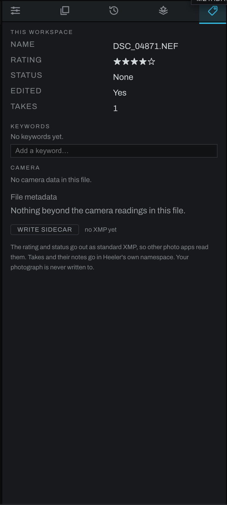

# Metadata tab

Metadata describes the active photograph, its place in the Heeler workspace, and the camera data embedded in the file.

## This workspace

This section shows the photograph's name, star rating, pick or reject status, edited state, take count and active take, along with file facts such as date, dimensions, and size when available. Rating and status update when they change in the thumbnails or Photo menu.

Baked DNGs also show **Baked from** with the original photograph or composite recipe filename. Camera data, stars, and keywords are carried into the new file.

## Keywords

Add descriptive keywords to make photographs easier to find and group. Existing catalog terms are suggested while typing. Keywords belong to the workspace catalog until you explicitly write metadata.

## Camera

Heeler displays only fields actually present in the file. Depending on the photograph, these can include camera, lens, capture time, shutter speed, aperture, ISO, focal length, and exposure compensation. A scanned or rendered image may correctly show no camera data.

## Writing a sidecar

Use **Write Sidecar** to write Heeler-specific metadata beside the photograph without modifying the original. The sidecar includes the rating, flag, active take, take names, take notes, and each take's star rating. Heeler writes it only when asked; merely viewing a photograph does not create a sidecar.

Use the Export panel's **Metadata: Keep/Strip** choice separately. That setting controls camera metadata in exported files and does not replace the workspace sidecar.
