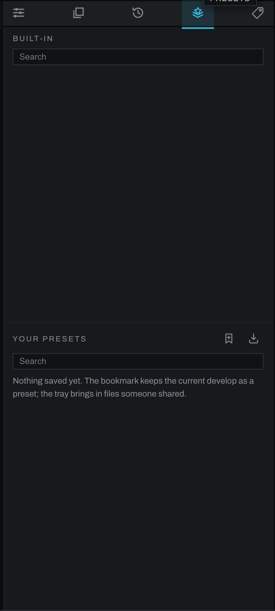

# Presets tab

Presets are saved looks. Applying one replaces the current Develop look while preserving what belongs to the photograph rather than the look: its crop, its develop layers with their masks, the document selection, any removals, and the Finish layer stack. One Undo returns to the previous look.

## Built-in presets

Built-in looks are read-only and grouped into categories. Categories begin collapsed, and stay as you leave them while the app is open, even after visiting another tab. Click a category to open it, or type in **Search** to show matching looks across categories. Click a preset name to apply it. Use **Export** to save a shareable copy.

## Your presets

Your presets work the same way but can be created and removed. The two glyphs beside the heading are the actions: the bookmark with a plus, **Save look**, stores the current Develop chain, and asks for a name and optional category; the tray with an arrow, **Import**, adds preset files. The remove button moves a user preset into `presets/.trash`; it does not permanently erase it.

Presets replace the whole look. To keep a group of nodes you drop into a graph beside what is there, save it as a node recipe instead: recipes are files too, in a `recipes` folder beside `presets`, with the same Import, Export and `.trash`. See [Node recipes](graph/recipes.md#recipe-files).

## What a look includes

A look is intended to transfer development decisions: exposure, color, curves, detail, and other Develop-chain operations. It does not capture the photograph's crop, its develop layers or their masks, the document selection, removals, or the Finish layer stack. This makes a look reusable across differently composed photographs.

## A practical workflow

1. Finish the global look on a representative photograph.
2. Open Presets and click the bookmark, **Save look**.
3. Name it for the result, not the source file, and assign a category if useful.
4. Open another photograph and click the new preset.
5. Fine-tune exposure and white balance for that frame.

## Calibrations and charts

The Color Checker's **Save calibration** writes a preset into the
**Calibrations** category: the fitted matrix, exposure, chart and report,
nothing about the photograph it was fitted on. A calibration applies from
the Color Checker section rather than from this tab, in one undo step, and
the section warns when the camera it was fitted on differs from the
photograph's. In the tab a calibration is an ordinary user preset, so it
exports and imports like any other.

Custom charts from the Color Checker's chart editor live beside the
presets in a `charts` folder, one JSON file per chart, and travel the same
way: the editor's **Import** and **Export** chips read and write the
files, and a chart file dropped into that folder lists beside the
built-in charts.
