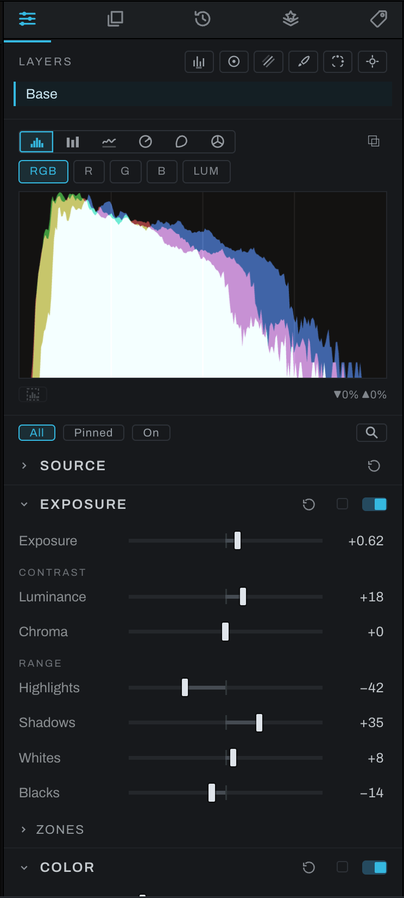

# Right panel

The right panel contains the controls for the current photograph. Drag its left divider to change the width. Icon tabs across the top select what the panel shows.

## Tabs

-  **Adjustments** develops the photograph with tonal, color, detail, depth, geometry, and lens controls. See [Adjustments](adjustments/README.md).
-  **Finish** manages pixel, gradient, fill, adjustment, Smart, Warp and image layers. See [Finish](finish/README.md).
-  **History** lists edit states for the active photograph. See [History](history.md).
-  **Presets** applies, saves, imports, and exports looks. See [Presets](presets.md).
-  **Metadata** shows workspace, file, and camera information and writes sidecars. See [Metadata](metadata.md).

Point to an icon to see its name and a short description in the status bar.

The Adjustments tab can also list only the sections you pinned or the ones switched on: see [Pinning and filtering](adjustments/README.md#pinning-and-filtering).

## Splitting the panel

Right-click a tab and move it to the other pane. This lets you keep two tabs visible, such as Adjustments above History or Finish above Metadata. Drag the horizontal separator to divide the height. Move the last lower tab back to return to one pane.

When a selection tool needs detailed controls, a Selection panel may appear automatically in the lower area. Minimize it to a bar when you need more room, or close it outright with its close button, which puts the select tool away; the selection itself stays.

## Common control behavior

- Click a section header to expand or collapse it.
- Use a section's switch to enable or disable its operation without deleting its settings. Switching a section on leaves it folded or open as it was; the Interface preference **Open a section when switched on** unfolds it instead.
- Drag a slider for visual adjustment. Click its number to type an exact value.
- Hold `Shift` while dragging for coarser, rounded steps where supported.
- Values typed beyond a slider's visible range may remain valid; the numeric value turns gold when the handle cannot represent it.
- Controls in a disabled, optional section can still be inspected. Changing one enables and builds that section.
- `Escape` puts away any armed picker or eyedropper first, and a second press cancels the active tool. Only one picker is ever armed: arming one puts away the one before it, and picking up a viewer tool (the brush, a crop, a light's handles) puts every picker away. Putting a tool down leaves an armed picker as it is.

## Adjust by Key

Adjust by Key drives the Adjustments panel without leaving the keyboard. Press its binding (default `A`) and letters appear over each section. Press a section's letter, then a control's letter, and the keys take over:

- `A`/`D` or Left/Right adjust the control; `W`/`S` or Up/Down drive a second axis where a control has one.
- `Shift` makes smaller steps.
- `J`/`K` move between the section's controls.
- `Backspace` returns to the section letters without leaving the mode; `Escape` leaves outright.
- While the section letters are showing, `Option` (`Alt` on Windows) plus a section's letter folds that section instead of entering it.

The binding can be changed in **Preferences > Hotkeys**, where it is listed as Adjust by Key.
