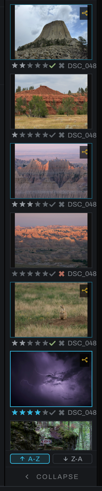
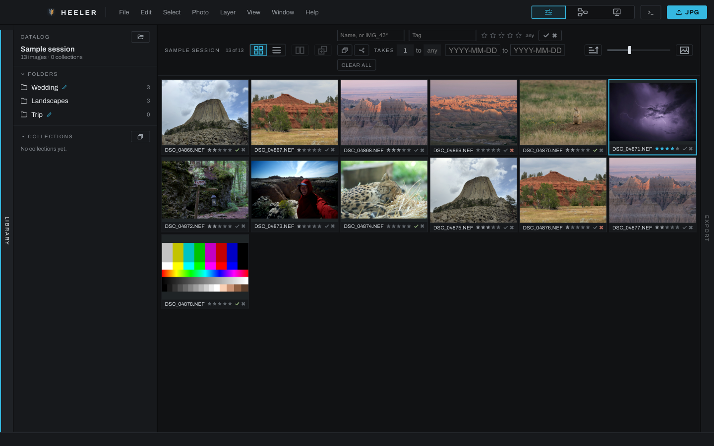

# Thumbnail view

A link mark in a thumbnail's top-left corner means the photograph is linked to others: an edit made on any of them lands on all of them. See [Link Selected](menus.md#photo).

The thumbnail panel shows the photographs in the current folder or collection. It is the main place to select, rate, flag, filter, and queue photographs.

## Panel layout

The panel can show picture thumbnails or a compact one-row-per-photo list. The header's first row holds the count on the left and the Photo view button on the right; the second row holds the two view icons on the left and the Filter button on the right, all four in one size. Drag the panel edge to change its width; thumbnail cells scale to fit. Collapse the panel to a rail when you want more viewport space.

The two sort buttons above the Collapse bar set the strip's direction: **A-Z** runs in file-name order, which on any camera is the order the photographs were taken, and **Z-A** reads the same list from the other end. The lit button is the direction in force. Arrow-key navigation follows the order on screen, and the list view keeps its own column sort independently.

Use the expand icon to fill the main window with the current folder or collection. The expanded catalog view hides the image viewport and offers the folder as a thumbnail grid or a sortable metadata table. Its header runs left to right: the Grid and Table switch, then Compare and Edit Together as icons, then the filters centered in the row rather than behind a funnel, then one sort button, in Grid view a size slider for the thumbnails, and Back to Photo, which restores the editing layout. Every icon button's name shows in the cursor tip. The filters are the ribbon's own: name, tag, minimum stars, a flag button that cycles from off to picks only (the check lit) to rejects hidden (the cross lit), and inverts the state it is in with an Option-click (Alt on Windows): picks hidden, or only the rejects, the lit mark turning red to say so, Merged (an icon of stacked frames), an edited button wearing the thumbnails' edit glyph that cycles from off to edited only to untouched only (struck through), the takes range as two number fields (1 to any), and Clear All. The sort button cycles between oldest first and newest first and is shared with the ribbon, so the strip and the grid always agree. Every tile in the grid wears the same five stars and pick and reject marks the ribbon's thumbnails do, and clicking them there rates or flags the photograph.

## Selecting photographs

- Click a photograph to open and select it.
- `Cmd` (`Ctrl` on Windows)-click adds or removes individual photographs.
- `Shift`-click selects a continuous range.
- The first photograph in a two-to-four-photo selection becomes the driver when using **Photo > Edit Together**.
- **Photo > Find in Thumbnails** scrolls to and flashes the active photograph.

Actions such as rating, flagging, adding to a collection, queuing, exporting, copying edits, stacking, and trashing use the thumbnail selection. Right-click inside a multi-selection to act on the selection; right-click outside it to act on that photograph.

## Filtering

Use the filter row to narrow by name, tag, stars, flag, edited state, versions/takes, and other available criteria. Name matching supports the wildcards `*` for any run of characters and `?` for one character. Clear filters if Find in Thumbnails says the active photograph is hidden.

The **Merged** button, an icon of frames stacked into one, shows only stacks and panoramas; click it again to show everything. **Takes** is two small number fields reading **1 to any**: the fewest and the most takes a photograph may have. Type a number, drag sideways on a field (ten pixels a take), or press the Up and Down arrows (with Shift, ten at a time). Empty the second field, or type `any`, for no upper limit; it reads **any** again at 10 and above. One end never passes the other: raising the minimum above the maximum raises the maximum with it, and lowering the maximum below the minimum lowers the minimum. The funnel's pop-up and the expanded catalog's header draw the same fields.

## Ratings and flags

Assign zero to five stars from the Photo menu, shortcut keys, or thumbnail context menu. **Pick** marks a keeper; **Reject** marks a reject without deleting it; **Clear Flag** removes either status. Ratings and flags appear in the Metadata tab and expanded table and can be used as filters.

## Expanded metadata table

Each row is a photograph. Available columns include Name, Rating, Status, Edited, Takes, Captured, Camera, Lens, Shutter, Aperture, ISO, Focal Length, Exposure Bias, Pixels, and File Size.

Click a column heading to sort; click again to reverse the order. Numeric fields sort numerically, exposure values sort photographically, and blank values remain at the bottom. Right-click a row for the same photograph menu available on a thumbnail.

## Thumbnail context menu

The context menu includes rating, flags, tags, collection and stacking actions (Stacking, Stitch to Panorama and Add to Stack), copy/paste edits, Edit Together, the link commands (Link Selected, Select Linked, Match to This Photo, Unlink and Pin out of Link), export queue and Quick Export, reset, Bake to Image, relink when missing, and Move to Trash where applicable. Disabled commands remain visible and their hint explains what selection or context enables them.
