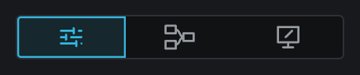
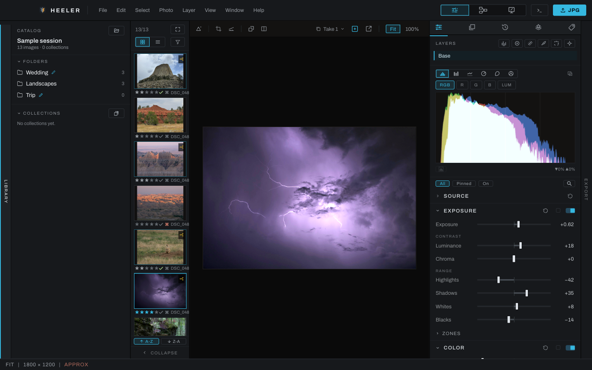
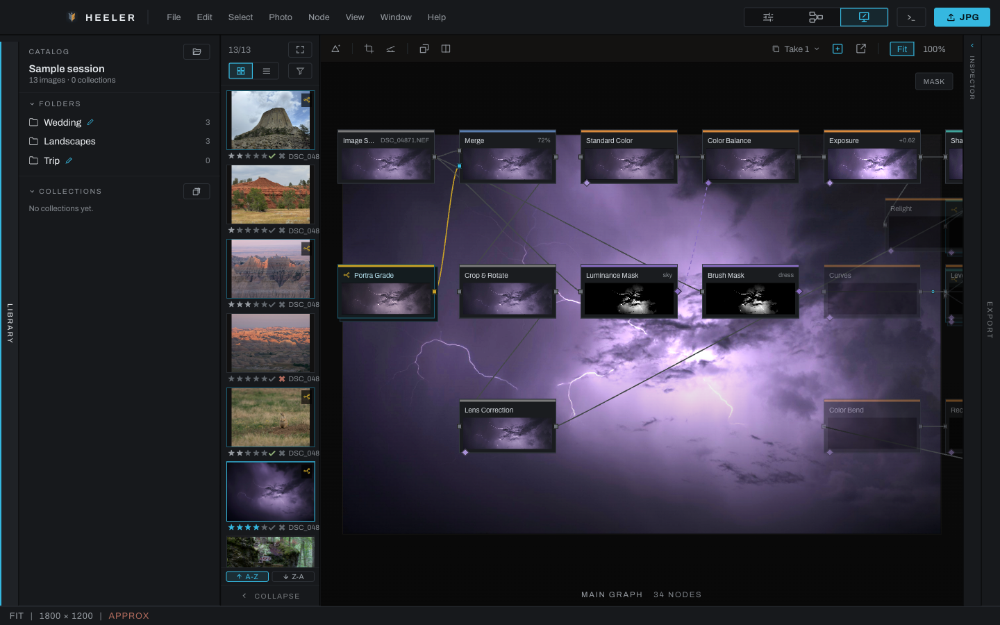

# Workspaces and window layout

The workspace switcher in the title bar changes how you see the same edit: sliders for Develop, three linked cards for Graph, a brush over a board for Canvas, each named in the status bar when the pointer rests on it. Switching workspaces does not make a copy and does not bake your work.

## Develop

Develop is the standard photo-editing workspace. From left to right it shows the Library, thumbnails, image viewport, right panel, and collapsible Export panel. The right panel contains both the Adjustments and Finish stages.

Use Develop for normal culling, global corrections, masks, retouching, and finishing layers. Drag the separators to resize the Library, thumbnails, and right panel. Heeler remembers the sizes, the collapsed panels, the workspace and the open pop-out windows between launches; the [Window menu](menus.md#window) resets the layout or brings every window back.

### On a small window or a large app zoom

The panels are sized in interface pixels, so a larger **App zoom** (Preferences) makes every one of them wider. When the window cannot hold them all, the photograph (or the graph, or the Library's catalog) keeps at least 320 interface pixels of width, and the panels give way in this order:

1. The Library, the thumbnails and the right panel narrow toward their smallest widths, the Library first and the right panel last.
2. The Library folds to its rail.
3. The Export panel folds to its rail.
4. The thumbnails fold to their thin strip.

The right panel never folds on its own. Folding here does not change your layout: the panels come back at their own widths as soon as the window is wide enough again, or the app zoom smaller. A folded panel's rail reads as closed, and clicking it opens the panel and keeps it open while the window stays small; the panels after it in the order give way instead, and if that is still not enough the photograph gets narrower than its usual minimum, since you asked for the panel. Dragging a separator wider stops where the photograph would go under its minimum.

The title bar keeps its menus and buttons on screen the same way: when they do not fit at the app zoom, the bar alone draws a little smaller, never below 100%. The library and photo name in the middle of the bar hides when it would print over the menus. In Graph, the viewer gives up height before the graph goes under 200 pixels, and the graph's key hints hide when they would print over the node count.

## Graph

Graph shows the image viewport above the node graph and replaces the Develop panel with a node inspector. Every Develop adjustment and Finish layer is represented in the graph. Use this workspace to inspect order, branch an edit, wire masks manually, group nodes, or work with operations that have no simplified Develop control.

The divider between the viewport and graph changes their relative heights. The graph can also open in a separate window.

## Canvas

Canvas places the graph over the image so the processing structure and result can be examined together. It uses the Node menu and graph editing model, and the same viewport toolbar as Develop and Graph, with the graph and a mask eye floating below it. The mask eye lights once a layer or a Color Set with a mask is active. This view is useful when spatially relating an operation to the photograph matters more than keeping the graph on a separate canvas.

## Shared regions

- The Library and thumbnail panel keep the current folder, collection, filter, and selection as you change workspaces.
- The image viewport keeps its image and comparison state.
- Export remains at the far right in every workspace.
- The status bar at the bottom shows pointer hints, temporary messages, zoom, resolution, and rendering status.
- The Console button in the title bar opens the console in its own window. Its Log tab holds the session's messages with a DEBUG switch for a fuller account, and icon buttons to copy the whole buffer, save it to a file of your choosing as it stands, or clear it. Its Python tab is the scripting scratchboard.
- Edits are saved as they are made. Closing the window waits for pending saves and saves already in progress, including quad-edit photographs. If saving fails, the window stays open and names the photograph or saved file and the error. **Retry save** tries the latest unsaved edit again; close the window after saving succeeds. Failed timer saves remain unsaved work even after changing photographs or takes. A retry cannot replace a newer saved edit with an older one. Export creates separate output files and does not change the source photograph.
- A photograph whose saved edits cannot be read shows a recovery notice and pauses automatic saving. Resolve that notice before closing. The [library page](library.md) describes the choices and the preserved files.

## Large images and preview memory

Heeler checks image dimensions and working memory before decoding or rendering. The allowance is the machine's physical memory; images held in the decode, proxy, raster and render caches and work already running are counted against it. There is no fixed megapixel ceiling, and a job the machine can hold is never refused.

When a preview cannot fit, Heeler tries the next smaller tier: full resolution, 4096, 2048, 1024, then 512 pixels on the long side. A successful reduction reports once in the status bar and Console. Native reduced decoding is available on macOS and Windows; a decoder that still needs more memory than is available refuses the image. If no tier fits, the last good preview stays visible and the status message names the file and the memory shortfall. Close other images to free their caches.

Exports keep their requested size. See [Export](export.md) for memory refusals.
